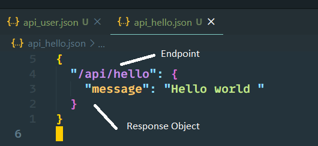
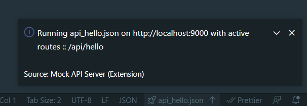

# MOCK-API-SERVER

Create Rest api with JSON file

## Usage

**1.** Create a JSON file like,



```
{
  "/endpoint": {
    "response": {}
  }
}
```

**2.** Click on Mock server icon on Statusbar (🚀 filename.ext ⬇️)


**3.** Thats it, your mock api is ready on port 9000



## Limitations

**1.** Mock server can serve only one file at a time.

**2.** Mock Server run on 9000 port.

## Roadmap

**1.** Support of multiple files simultaneously

**2.** User able to change port
